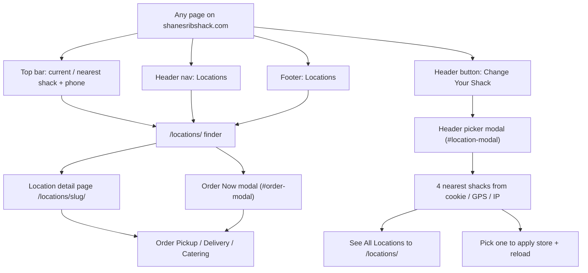
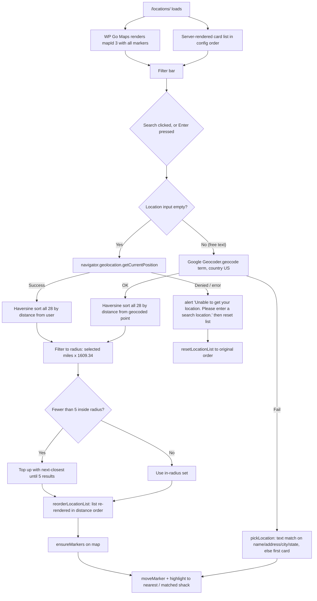
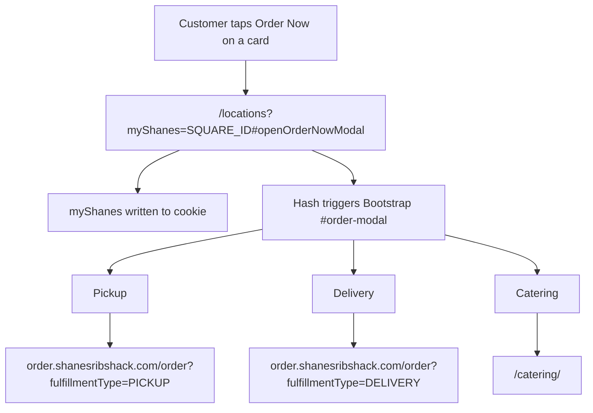
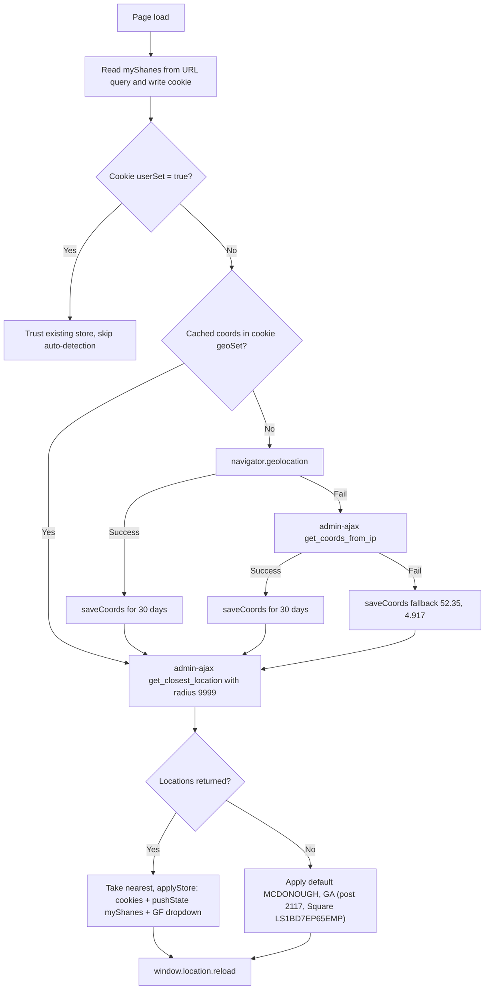
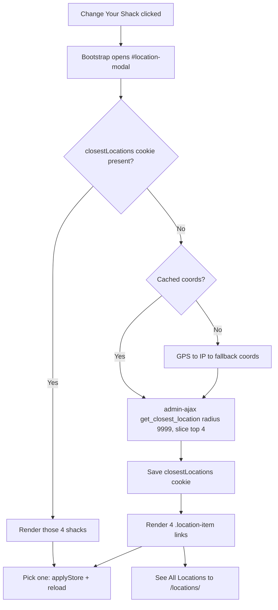
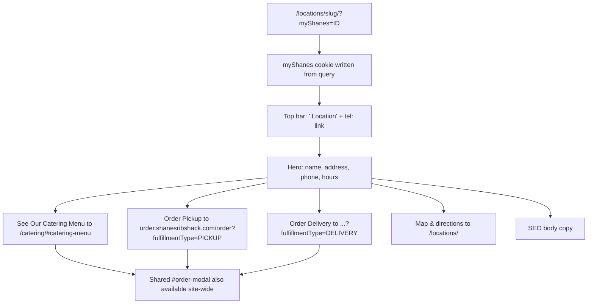
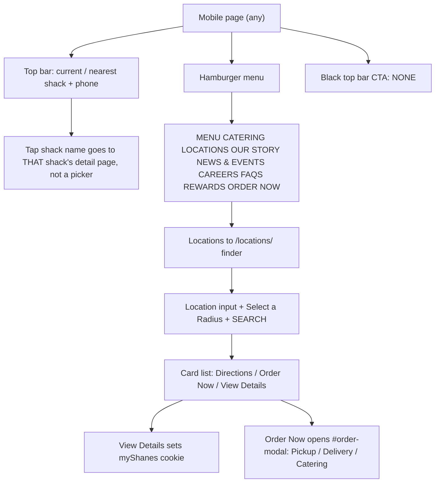

# Live WordPress "Find a Shack" flow — shanesribshack.com

**Scope:** this documents the **live WordPress production site** (`www.shanesribshack.com`), not the
Next.js prototype in this repo. The prototype's `/locations/` page is a simplified static mirror
(6 cards, no geocoding, static map); do not conflate the two.

**Verified against (2026-09-23, live assets):**

| Asset | What it proves |
| :--- | :--- |
| `/locations/` HTML | Finder markup, 28 card entries, search/radius controls, WPGMZA map `mapId: 3`, `window.tcmInteractiveMaps` config (28 locations with lat/lng + Square IDs) |
| `wp-content/themes/cm-shanes/js/location-map-loader.js` | Store cookies, GPS/IP/fallback detection, sticky `myShanes`, header modal, Gravity Forms dropdown wiring, recipient-email lookup |
| `wp-content/plugins/tcm-vc/inc/js/interactive-map.js` | Finder search: geocode, Haversine sort, radius filter, list re-render, marker move |
| `/locations/chattanooga-tn/?myShanes=...` HTML | Detail page hero + CTAs, per-location top bar, shared `#order-modal` |
| `wp-json/shanes/v1/topbar` | Top-bar `#location` slot is filled dynamically |

---

## 1. Entry points



Two separate pickers exist and are easy to confuse:

- **`#location-modal`** — the site-wide header picker behind **Change Your Shack**. Shows the **4 nearest** shacks.
- **`#locationModal`** — a modal that `location-map-loader.js` **injects next to Gravity Forms store
  dropdowns**, with its own autocomplete + map + "Use this Location". This is a different element with a
  different id (`location-modal` vs `locationModal`).

---

## 2. The finder page — `/locations/`

**Layout:** filter bar (Location input · OR · Select a Radius · Search) → Google map (WP Go Maps,
map ID 3) → "Find a Shack" card list (28 shacks, distance-ordered at runtime).

**Data:** every card is server-rendered from the `window.tcmInteractiveMaps` config, one object per
shack with `id` (WP post id), `square_id`, `url`, `name`, `address`, `phone`, `city`, `state`,
`latitude`, `longitude`, `directions`, `ez_cater_url`, `order_online_link`, `location_label`, `info`.
There is **no live store-locator API** for the initial list — it is static HTML plus client-side sort.



**Radius control:** 10 / 25 / 50 / 100 miles, default **25**. The JS falls back to 25 if the value
cannot be parsed.

**Important side effect:** the radius filter **always returns at least 5 shacks**. If fewer than 5 sit
inside the chosen radius, the list is padded with the next-closest shacks outside the radius — so a
"10 miles" search in a sparse area still lists far-away shacks.

### Card actions (initial server-rendered state)

| Action | Target | Notes |
| :--- | :--- | :--- |
| **Directions** | `https://www.google.com/maps/dir/?api=1&destination=<address>` | New tab |
| **Order Now** | `/locations?myShanes=<squareId>#openOrderNowModal` | Hash opens the shared `#order-modal` |
| **View Details** | `/locations/<slug>/?myShanes=<squareId>` | Desktop + mobile variants; map info-window has a third link |



> Note: the order links carry **only** `fulfillmentType`. The `locationId` injection into the ordering
> URL is present but **commented out** in the theme JS (task `86ajhc2w8`), so the selected shack reaches
> the order platform via the `myShanes` **cookie**, not the query string.

---

## 3. Sticky store selection — the `myShanes` engine

`location-map-loader.js` is the core of the flow. It runs on every page load.



**What "apply store" writes:**

| Cookie | Contents | Lifetime |
| :--- | :--- | :--- |
| `myShanes` | Square location id (e.g. `LRGX51T4E3AVA`) | 365d |
| `myShanesPost` | WP post id | 365d |
| `locationName` | Display label, e.g. `Chattanooga, TN` | 365d |
| `orderOnlineLink` / `ezCaterUrl` | Store's order + catering URLs | 365d |
| `userSet` | `true` — stops future auto-selection | 365d |
| `nearbyLoc` | State, derived from the label | 365d |
| `closestLocations` | JSON of up to 4 nearest shacks | 30d |
| `curLat` / `curLong` / `geoSet` | Cached coordinates | 30d |

**How the store stays sticky:** after selection, the script appends `?myShanes=<id>` to every
same-domain `<a href>` that does not already carry it. That is why detail URLs on the live site read
`/locations/chattanooga-tn/?myShanes=LRGX51T4E3AVA`.

**Gravity Forms tie-in:** the store is written into the store dropdowns for forms `2/1`, `3/15`, `4/30`,
`5/41`, and a **Select location** button is injected beside each dropdown to reopen the picker. On
dropdown change, `admin-ajax get_recipient_emails_by_post_id` fills hidden recipient/address/phone
fields (keys: `catering`, `jobs`, `default`, `store_location`, `store_address`,
`store_catering_phone`).

---

## 4. Header picker — "Change Your Shack"



While no locations resolve, the modal body shows a **loading spinner**, and if geolocation fails
entirely it renders "Unable to detect your location. Please enter an address to search for locations."

---

## 5. Location detail page → order



The detail page top bar is rendered **per shack** — Chattanooga's page shows "Chattanooga Location"
and `tel:+14237029801`, whereas the finder page's default top-bar location is **The Original Location**.

---

## 6. Delivery caveat

The `shanes/v1/topbar` REST endpoint returns the top-bar HTML with an **empty `#location` slot**
("Updated dynamically via AJAX"), so the current-shack indicator depends on the theme's AJAX layer
resolving. If that call fails, the slot can stay empty or fall back to the server-rendered default.

---

## 7. Known quirks worth calling out (all verified in source)

1. **Radius is a soft filter.** The list is always padded to a minimum of 5, so a tight radius can
   still show shacks outside it.
2. **Searching rebuilds cards and drops "Order Now."** `reorderLocationList()` re-renders each card
   with only **Directions** and **View Details** — after any search, the Order Now button is gone until
   reload. This is the biggest UX inconsistency in the flow.
3. **"Use this Location" in the Gravity Forms modal appears dead.** `renderModalLocations()` emits
   `class="link-button"`, but the click handler binds to `.use-location-btn`. Map **marker clicks** in
   that modal do work (`applyStore` + reload).
4. **Order URLs no longer carry `locationId`** — deliberately commented out (task `86ajhc2w8`). Store
   continuity relies on the cookie, so clearing cookies loses the selected shack.
5. **Fallback coordinates are Amsterdam** (`52.35, 4.917`, labelled `Constitution §III: O_fallback`).
   If both GPS and IP geolocation fail, the "nearest" shack is computed from Europe.
6. **Header "Change Your Shack" and the finder are separate surfaces.** The header shows only 4 nearest;
   `/locations/` shows all 28 with map + radius.
7. **No closed-temporarily state** exists on the live finder: all 28 shacks render as active (the
   prototype has a `closedTemporarily` variant the live site does not use).
8. **Two near-identical modal ids** (`location-modal` header, `locationModal` injected) invite
   maintenance mistakes.

---

## 8. Suggested demo click path (talking order)

1. **Homepage** — point out the top bar showing the nearest shack and the header **Change Your Shack**.
2. **Change Your Shack** — modal lists the 4 closest; **See All Locations**.
3. **`/locations/`** — search by city/ZIP **or** radius-only (triggers geolocation), map pans, list
   reorders by distance.
4. **A card** — Directions (Google Maps), Order Now (Pickup/Delivery/Catering modal), View Details.
5. **View Details** — note `?myShanes=` in the URL and the top bar switching to that shack.
6. **Sticky store** — browse to another page; the `myShanes` cookie keeps the shack selected, and
   Gravity Forms store dropdowns are pre-filled.

---

## 9. Mobile behaviour — and the "Change Your Shack" button

Verified with a real Chrome session at **390 × 844** (iPhone-class mobile UA), not by reading CSS alone.

### 9.1 The headline finding

> **The "Change Your Shack" button is hidden on mobile.** On the live site the header CTA computes to
> `display: none` at mobile width. There is no equivalent control anywhere else on the page.

`getComputedStyle` on `.shackLocation` (text "Change Your Shack") at 390px:

```
display: none   visibility: visible   width: 0   height: 0   offsetParent: false
parent: div#logo  display: flex  width: 43px   (round mobile logo only)
```

The mobile header is just: **hamburger · round logo · ORDER NOW**.

### 9.2 What a mobile user can actually do



So on mobile, **changing your shack is: hamburger → LOCATIONS → search the finder → View Details**. The
selection only sticks once `myShanes` is written by a detail-page visit or an Order Now tap.

Two further mobile facts:

1. **No map on mobile.** `.wpgmza_map` renders at **height 0** (offset far down the page), so mobile gets
   the search controls and the card list only. The tall `.map_container` wrapper is still ~1109px, which
   is what makes the page feel long.
2. **The top-bar shack name is a detail-page link, not a switcher.** On `/locations/` it resolved to
   `…/locations/edgewood-atlanta-ga/?myShanes=LB1VY6W2WA7RZ` — i.e. the nearest/selected shack — and it
   navigates there. It never opens `#location-modal`.

### 9.3 Why the button disappears — and the trap behind it

The picker it drives (`#location-modal`, Bootstrap `data-target="#location-modal"`) still exists in the
DOM on mobile, but the only trigger is the hidden button. So on mobile the modal is **unreachable** unless
something else opens it. This is the single most consequential mobile gap in the flow.

### 9.4 Mobile flow that *does* work

- Finder search + radius: functional (input, select, SEARCH).
- **Order Now** tap: verified opening the shared `#order-modal`; the URL gains `?myShanes=…`.
- Directions / mobile-only View Details: both render correctly in the card stack.

### 9.5 Prototype comparison (this repo)

Same viewport probes against the local static build:

| Behaviour | Live WordPress | This prototype |
| :--- | :--- | :--- |
| Mobile "change location" control | **Hidden (`display:none`)** | Black alert: full-width red **CHANGE YOUR LOCATION** → `/locations/` |
| On `/locations/` itself | n/a (button hidden) | Same alert button, but it **self-links to `/locations/`** (no-op) |
| On a location detail page | Button hidden; top bar is shack + phone | Alert switches to shack + phone + app promo, so the button **disappears**; only the hamburger drawer shows **CHANGE YOUR SHACK** |
| Hamburger drawer | No change-shack item | **CHANGE YOUR SHACK** button present |
| Finder map | Rendered at height 0 (absent) | Deliberately desktop-only (`hidden … lg:block`) |
| Store persistence | `myShanes` cookie, 365d, appended to links | **None** — hero "Make My Shack" is local `useState` only; forgets on reload |

The prototype's "Make My Shack" in `components/LocationHero.tsx` flips the label to "Current Shack" and
fills a heart, but persists nothing — it is a visual stub, not the live cookie mechanism.

### 9.6 Mobile demo path

1. Open the site on a phone (or 390px responsive mode).
2. Point out the top bar: current shack + phone, tappable, but **not** a switcher.
3. Note there is **no "Change Your Shack" button** anywhere in the mobile header.
4. Hamburger → **LOCATIONS** → the finder (search + radius, **no map**).
5. Search, pick a shack, **View Details** — this is the moment the shack actually changes (cookie set).
6. Tap **Order Now** — Pickup / Delivery / Catering modal opens, still on the chosen shack.
